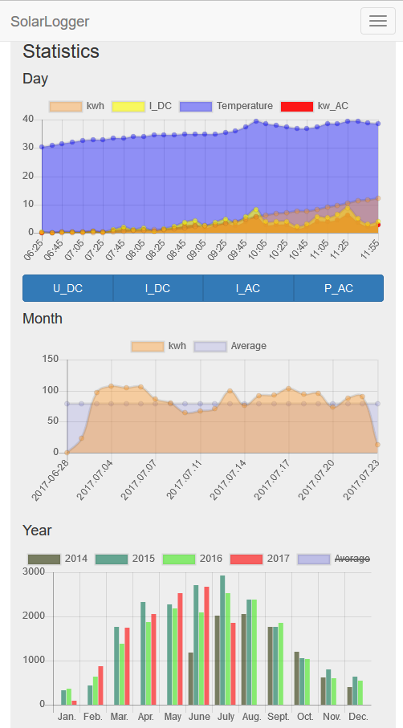

# SolarLogger.Viewer
Displays statistics based on delivered data form repo SolarLogger.Reader 

# SolarLogger.Reader
Does read data form 2 SolarMax converters by ethernet and creates a dataset by sending a POST to the SolarLogger.Viewer
